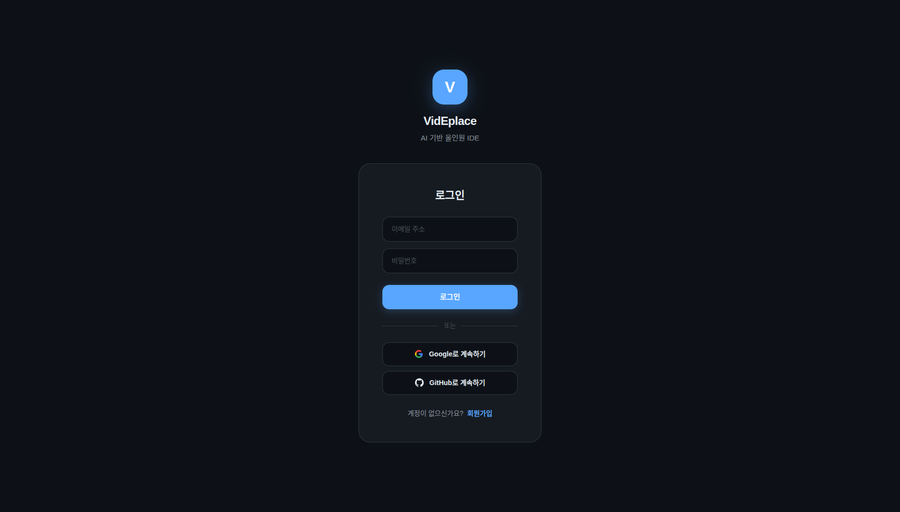
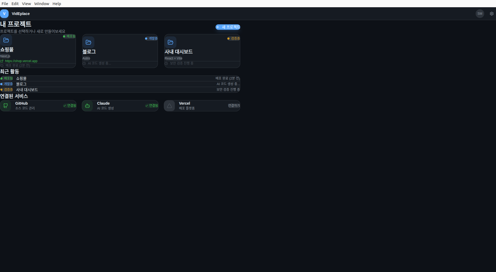
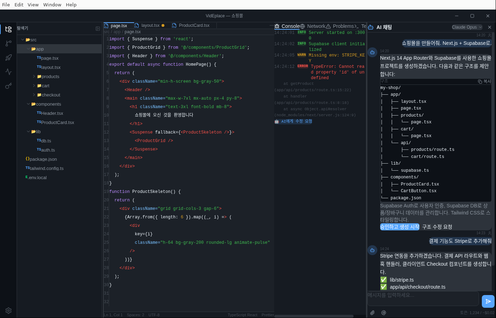
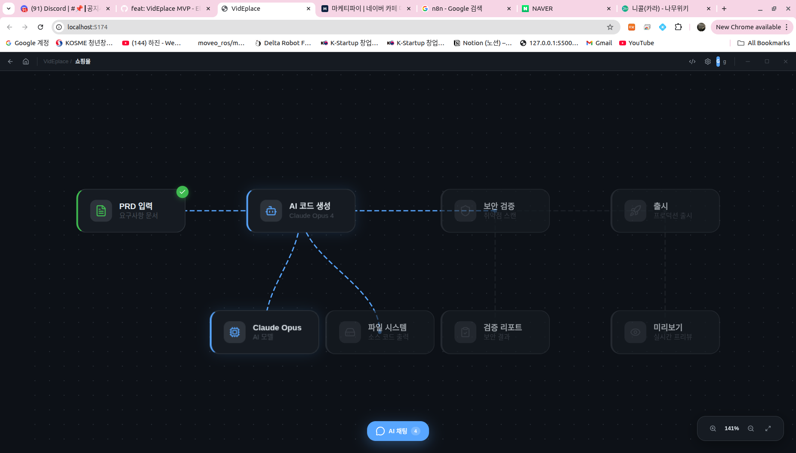

<p align="center">
  
</p>

<h1 align="center">VidEplace</h1>

<p align="center">
  <b>AI 기반 올인원 IDE</b> — PRD 작성부터 코드 생성, 보안 검증, 출시까지<br/>
  <i>Write the idea. We build, verify, and ship it.</i>
</p>

<p align="center">
  
  
  
  
  
  
</p>

---

## 소개

**VidEplace** (Vibe + Dev + Place)는 비개발자도 아이디어만 있으면 안전한 프로덕션 서비스를 만들 수 있는 **올인원 Electron IDE**입니다.

PRD를 작성하면 AI가 코드를 생성하고, 자동으로 보안/품질 검증을 거친 후 원클릭으로 출시할 수 있습니다. 사용자는 자신의 AI 계정(Claude, OpenAI, Gemini 등)을 연결하여 사용합니다.

### 핵심 가치

```
아이디어 → AI 코드 생성 → 보안 검증 → 원클릭 출시
```

### 경쟁 우위

| 기능 | Bolt.new | Lovable | Replit | Cursor | **VidEplace** |
|------|----------|---------|--------|--------|---------------|
| 코드 생성 | O | O | O | △ | **O** |
| 보안 검증 | X | X | X | X | **O** |
| 출시 | △ | △ | O | X | **O** |
| 모니터링 | X | X | X | X | **O** |
| 로컬 접근 | X | X | X | O | **O** |
| BYOK | X | X | X | △ | **O** |
| 소셜 로그인 | X | O | O | X | **O** |
| DB 연동 | X | X | O | X | **O** |

---

## 주요 화면

### 로그인


이메일/비밀번호, Google, GitHub, Apple 소셜 로그인을 지원합니다.

### 대시보드


내 서비스 목록, 실제 개발 환경 감지, 35개 이상의 외부 서비스 연결 상태를 한눈에 확인합니다.

### 서비스 연동 (실제 Webview)


20개 서비스를 실제 웹사이트에서 로그인하고 API 키를 가져올 수 있습니다. 왼쪽 가이드를 따라가면서 오른쪽 웹뷰에서 직접 작업합니다.

### 코드 에디터 (VS Code 스타일)


Monaco Editor 기반 VS Code 스타일 레이아웃: 사이드바 + 코드 에디터 + AI 채팅 + 하단 콘솔/터미널.

### 워크플로우 캔버스


AI 코딩 파이프라인을 노드 기반으로 시각화합니다.

---

## 구현 완료 기능

### 백엔드 서비스 (15개, 90+ IPC 핸들러)

| 서비스 | 설명 | 상태 |
|--------|------|------|
| **Auth** | 이메일 로그인 + 소셜 로그인 (Google/GitHub/Apple) | ✅ |
| **Supabase** | 클라우드 DB 연동 (유저/프로젝트/구독 저장) | ✅ |
| **Connections** | 20개 서비스 암호화 인증 저장 (AES-256-GCM) | ✅ |
| **Payment** | Stripe 실제 결제 + Supabase DB 동기화 | ✅ |
| **AI** | Claude/OpenAI 실시간 스트리밍 채팅 | ✅ |
| **File System** | 로컬 파일 읽기/쓰기/삭제 + 틸다 경로 해석 | ✅ |
| **Terminal** | node-pty 기반 실제 터미널 | ✅ |
| **Git** | simple-git 기반 버전 관리 | ✅ |
| **Security** | 코드 보안 스캔 (시크릿, XSS, eval 등) | ✅ |
| **Deploy** | Vercel/Netlify/Cloudflare/Railway 배포 | ✅ |
| **Monitoring** | URL 상태 모니터링 + 알림 | ✅ |
| **Error Tracking** | 에러 추적 및 리포트 | ✅ |
| **Cost Tracking** | AI 비용 추적 + 예산 관리 | ✅ |
| **Team** | 팀 생성/초대/멤버 관리 | ✅ |
| **Updater** | electron-updater 자동 업데이트 | ✅ |

### 프론트엔드 (8 페이지, 24+ 컴포넌트)

| 페이지 | 설명 |
|--------|------|
| LoginPage | 이메일 + 소셜 로그인 (Google/GitHub/Apple) |
| PricingPage | 요금제 선택 (Free/Pro/Team/Enterprise) |
| OnboardingPage | AI 키 설정 + GitHub 연결 + 테마 선택 |
| DashboardPage | 서비스 관리 + 실시간 환경 감지 + 서비스 연결 |
| IDEPage | VS Code 스타일 에디터 + 워크플로우 캔버스 |
| SettingsPage | 테마/언어/에디터/팀/결제/업데이트 관리 |
| NewServicePage | 4단계 위저드 + AI 코드 생성 |
| WatchdogPage | URL 모니터링 대시보드 |

### 서비스 연동 (20개, 실제 Webview + 가이드)

| 카테고리 | 서비스 |
|---------|--------|
| AI | Claude, OpenAI, Gemini, Ollama |
| Git | GitHub, GitLab, Bitbucket |
| 배포 | Vercel, Railway, Netlify, Cloudflare, AWS |
| DB | Supabase, Firebase |
| 결제 | Stripe, 토스페이먼츠 |
| 알림 | Slack, Discord |
| 앱 스토어 | Apple Developer, Google Developer |

### 기타

- [x] 다크/라이트/모노카이 테마
- [x] 한국어 + 영어 (i18n)
- [x] React.lazy 코드 스플리팅 (메인 번들 397KB)
- [x] TypeScript 0 에러
- [x] electron-builder 패키징 (Linux/Mac/Windows)
- [x] 랜딩 페이지 (`landing/index.html`)
- [x] Supabase DB 스키마 (`supabase/schema.sql`)

---

## 기술 스택

| 레이어 | 기술 |
|--------|------|
| 프레임워크 | Electron 41 |
| UI | React 19 + TypeScript 5.9 |
| 스타일 | Tailwind CSS 4 + 커스텀 CSS 모듈 |
| 코드 에디터 | Monaco Editor |
| 상태 관리 | Zustand 5 |
| 백엔드 DB | Supabase (PostgreSQL) |
| 인증 | Supabase Auth + 로컬 폴백 + OAuth |
| 결제 | Stripe SDK |
| AI | @anthropic-ai/sdk + openai |
| 터미널 | node-pty + xterm.js |
| Git | simple-git |
| 빌드 | Vite 6 + electron-builder |
| 암호화 | AES-256-GCM (자격 증명 저장) |

---

## 프로젝트 구조

```
src/
├── main/                        # Electron Main Process
│   ├── main.ts                  # 앱 진입점 + OAuth 프로토콜 핸들러
│   └── services/
│       ├── auth.ts              # 인증 (이메일 + 소셜 + Supabase)
│       ├── supabase.ts          # Supabase 클라이언트
│       ├── connections.ts       # 서비스 연결 암호화 저장
│       ├── payment.ts           # Stripe 결제 + DB 동기화
│       ├── ai.ts                # Claude/OpenAI API
│       ├── fileSystem.ts        # 파일 시스템
│       ├── terminal.ts          # PTY 터미널
│       ├── git.ts               # Git 연동
│       ├── security.ts          # 보안 스캔
│       ├── deploy.ts            # 배포 (Vercel/Netlify/Railway/CF)
│       ├── monitoring.ts        # URL 모니터링
│       ├── errorTracking.ts     # 에러 추적
│       ├── costTracker.ts       # 비용 추적
│       ├── team.ts              # 팀 관리
│       └── updater.ts           # 자동 업데이트
├── preload/
│   └── preload.ts               # IPC 브릿지 (90+ 메서드)
└── renderer/                    # React UI
    ├── App.tsx                  # 라우팅 + lazy loading
    ├── pages/                   # 8개 페이지
    ├── components/
    │   ├── auth/                # 서비스 연동 모달 (20개 서비스 webview)
    │   ├── chat/                # AI 채팅 (실시간 스트리밍)
    │   ├── editor/              # Monaco 코드 에디터
    │   ├── sidebar/             # 파일탐색기, Git, 배포, 보안, 계정
    │   ├── workflow/            # 워크플로우 캔버스
    │   ├── terminal/            # xterm.js 터미널
    │   ├── debug/               # 콘솔/네트워크/문제/터미널
    │   └── common/              # NavBar, Toast, StatusBadge 등
    ├── stores/                  # Zustand 스토어
    ├── i18n/                    # 한국어/영어 번역
    └── types/                   # TypeScript 타입 정의

landing/                         # 랜딩 페이지 (정적 HTML)
supabase/                        # DB 스키마
```

---

## 시작하기

### 요구사항
- Node.js 18+
- npm 9+

### 설치 및 실행

```bash
# 클론
git clone https://github.com/SeongminJaden/videplace.git
cd videplace

# 의존성 설치
npm install --legacy-peer-deps

# Main Process 컴파일
npx tsc -p tsconfig.main.json

# 개발 모드 실행 (Vite + Electron)
npm run dev:electron
```

### 프로덕션 빌드

```bash
# 전체 빌드
npm run build:all

# Linux 패키징
npm run dist:linux

# macOS 패키징
npm run dist:mac

# Windows 패키징
npm run dist:win
```

---

## 설정 가이드

### 1. Supabase 설정 (선택, 클라우드 DB 사용 시)

```bash
# Supabase 프로젝트 생성 후 schema 적용
# supabase.com에서 SQL Editor에 supabase/schema.sql 실행

# 앱에서 설정
# 설정 > Supabase 연결 또는:
~/.videplace/supabase.json
{
  "url": "https://YOUR_PROJECT.supabase.co",
  "anonKey": "YOUR_ANON_KEY"
}
```

Supabase Dashboard에서 Google/GitHub/Apple OAuth 프로바이더를 활성화하면 소셜 로그인이 동작합니다.

### 2. OAuth 설정 (선택, Supabase 없이 소셜 로그인)

```bash
# GitHub: https://github.com/settings/developers → OAuth Apps → New
# Callback URL: http://localhost:39281/callback

# Google: https://console.cloud.google.com/apis/credentials → OAuth 2.0
# Redirect URI: http://localhost:39281/callback

~/.videplace/oauth.json
{
  "github": "YOUR_GITHUB_CLIENT_ID",
  "google": "YOUR_GOOGLE_CLIENT_ID"
}
```

### 3. Stripe 설정 (선택, 실제 결제)

앱 내 서비스 연결에서 Stripe를 연결하거나:
```bash
~/.videplace/payment.json  # 앱이 자동 관리
```

### 4. AI 서비스 설정

앱 내 서비스 연결에서 Claude/OpenAI/Gemini를 연결합니다. API 키는 AES-256-GCM으로 암호화되어 `~/.videplace/connections.json`에 저장됩니다.

---

## 앱 플로우

```
로그인 → 요금제 선택 → 온보딩 → 대시보드 → 워크플로우/IDE
```

1. **로그인**: 이메일 또는 Google/GitHub/Apple 소셜 로그인
2. **요금제 선택**: Free / Pro / Team / Enterprise (Stripe 실제 결제)
3. **온보딩**: AI 서비스 연결, GitHub 연결, 테마 선택
4. **대시보드**: 내 서비스 목록, 실제 개발 환경 감지, 서비스 연결 관리
5. **워크플로우 캔버스**: AI 코딩 파이프라인 시각화 + 채팅 위젯
6. **코드 에디터**: VS Code 스타일 (Monaco 에디터 + AI 채팅 + 터미널 + 디버그 콘솔)

---

## 요금제

| 플랜 | 가격 | 주요 기능 |
|------|------|----------|
| **Free** | $0 | 서비스 1개, 기본 검증 |
| **Pro** | $12/월 | 서비스 5개, 풀 검증, 출시 3개 |
| **Team** | $29/seat/월 | 무제한, 팀 협업, 모니터링 |
| **Enterprise** | 커스텀 | 온프레미스, SSO, SLA |

> AI 비용은 사용자가 자신의 계정으로 직접 부담 (BYOK 방식)

---

## 문서

| 문서 | 설명 |
|------|------|
| [PRD.md](PRD.md) | 제품 요구사항 문서 |
| [DEVELOPMENT_GUIDE.md](DEVELOPMENT_GUIDE.md) | 개발 가이드 (아키텍처, 기능 명세) |
| [DESIGN_GUIDE.md](DESIGN_GUIDE.md) | 디자인 가이드 (CSS 클래스, 테마) |
| [CHANGELOG.md](CHANGELOG.md) | 변경 이력 |

---

## 라이선스

MIT License
